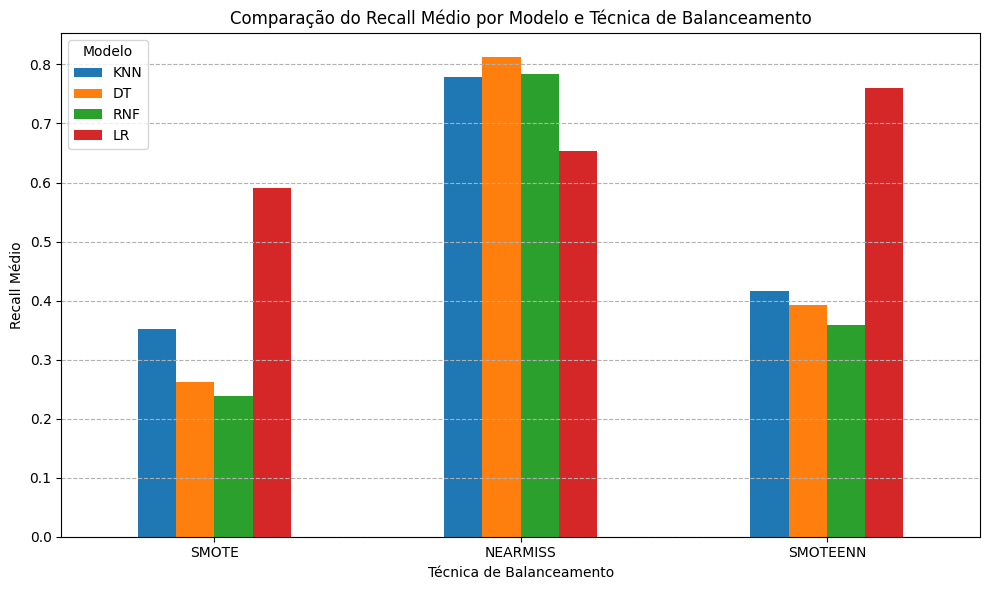
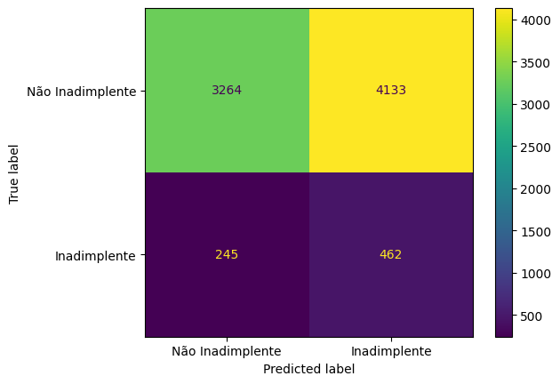

# Validação de Modelos e Métricas de Avaliação para Classificação de Inadimplentes

## 🎯 Sobre o Projeto

Este projeto tem como objetivo principal aprimorar os conhecimentos acerca de ténicas de aprendizado de máquina, investigando, de mandeira hipotética, um caso de identificação de clientes inadimplentes para uma empresa de empréstimo de automóveis. Utilizando técnicas de Machine Learning, o projeto foca na classificação de clientes em adimplentes e inadimplentes, testando e otimizando diferentes modelos de classificação.

## 📊 Fonte dos Dados

Os dados utilizados neste projeto foram carregados a partir do seguinte CSV:

    url = 'https://raw.githubusercontent.com/VSennaa/ml_defaulters_classifier/refs/heads/main/emp_automovel.csv'

## 🛠️ Metodologia

O projeto seguiu as seguintes etapas:

1.  **Análise Exploratória e Pré-processamento:**
    * Carregamento e cópia dos dados.
    * Verificação inicial dos tipos de dados.
    * Visualização da distribuição de variáveis como `receita_cliente` e `anuidade_emprestimo` em relação à inadimplência usando histogramas e boxplots (com `plotly.express`).

2.  **Criação de Modelo Inicial:**
    * Um modelo de Árvore de Decisão (`DecisionTreeClassifier`) foi criado como baseline, com `max_depth=10` e `random_state = SEED` (onde `SEED = 123`).

3.  **Divisão dos Dados:**
    * Os dados foram divididos em conjuntos de treino, validação e teste para uma avaliação robusta dos modelos.
        * Primeira divisão: 15% para teste (`x_teste`, `y_teste`), 85% restante para treino/validação.
        * Segunda divisão (do conjunto de 85%): 15% para validação (`x_val`, `y_val`), resultando em aproximadamente 72.25% do total para treino (`x_treinoP`, `y_treinoP`).
    * A estratificação (`stratify=y`) foi utilizada para manter a proporção das classes.

4.  **Métricas de Avaliação:**
    * **Matriz de Confusão:** Para visualizar os Verdadeiros Positivos (VP), Falsos Positivos (FP), Verdadeiros Negativos (VN) e Falsos Negativos (FN).
    * **Métricas Derivadas:** Acurácia, Precisão, Recall e F1-Score.
    * **Curvas de Avaliação:** Curva ROC e Curva de Precisão x Recall.
    * **Relatório de Classificação:** `classification_report` do Scikit-learn.

5.  **Validação Cruzada:**
    * Utilização de `KFold` e `StratifiedKFold` (com `n_splits=5`) para uma avaliação mais consistente, mitigando a dependência de uma única divisão dos dados.
    * A função `cross_validate` foi empregada para obter múltiplas métricas.
    * Foi definida uma função `media_desvio` para reportar a média e o desvio padrão das métricas obtidas na validação cruzada.

6.  **Comparação e Otimização de Modelos:**
    * **Modelos Testados:**
        * Árvore de Decisão (`DecisionTreeClassifier`)
        * Random Forest (`RandomForestClassifier`)
        * K-Nearest Neighbors (`KNeighborsClassifier`)
        * Regressão Logística (`LogisticRegression`)
    * **Balanceamento de Dados (nos dados de treino):**
        * **Oversampling:** SMOTE (`imblearn.over_sampling.SMOTE`)
        * **Undersampling:** NearMiss (`imblearn.under_sampling.NearMiss`)
        * **Combinado:** SMOTEENN (`imblearn.combine.SMOTEENN`)
    * **Pipeline:**
        * Uso de `imblearn.pipeline.Pipeline` para encadear etapas de pré-processamento (como `StandardScaler` para Regressão Logística e KNN) e balanceamento com o treinamento do modelo.

## 📈 Resultados e Avaliação

Após a aplicação de validação cruzada estratificada e técnicas de balanceamento, os resultados de **Recall** (métrica priorizada para minimizar falsos negativos - clientes inadimplentes não identificados) foram comparados para os diferentes modelos e técnicas de balanceamento:

| Técnica de Balanceamento | KNN      | DT       | RNF      | LR       |
| :----------------------- | :------- | :------- | :------- | :------- |
| SMOTE                    | 0.351453  | 0.261913  | 0.237963  | 0.590671  |
| NearMiss                 | 0.778004  | 0.812921  | 0.783486  | 0.653779  |
| SMOTEENN                 | 0.416810  | 0.393359  | 0.358942  | 0.760537  |

Foi gerado um gráfico de barras para visualização comparativa desses resultados.
O modelo final destacado no notebook para uma análise de desempenho nos dados de teste foi a **Regressão Logística com NearMiss e StandardScaler**, cuja matriz de confusão foi plotada.

  

  

## 💻 Principais Bibliotecas Utilizadas

* `pandas`
* `numpy`
* `matplotlib.pyplot`
* `plotly.express`
* `sklearn` (tree, model_selection, metrics, ensemble, neighbors, linear_model, preprocessing)
* `imblearn` (over_sampling, under_sampling, combine, pipeline)

## 🚀 Como Utilizar/Reproduzir

1.  Certifique-se de ter todas as bibliotecas listadas acima instaladas.
2.  Faça o download do notebook (`.ipynb`).
3.  Execute as células sequencialmente em um ambiente Python (como Jupyter Notebook, Google Colab).
4.  O `SEED` utilizado para reprodutibilidade foi `123`. A profundidade máxima (`PROFUNDIDADE`) para árvores foi `10`.

## 📧 Contato

Vinicios Rodrigo
vsennamart@gmail.com
